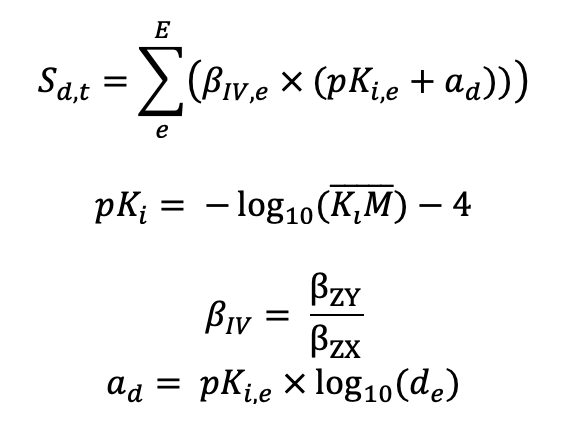

# Predicting Side-effects of Medication Using Mendelian Randomization 
Example of calculating the side effect scores using Mendelian Randomization results and binding affinity data

## Example:

An example of how to run the code described in `calculate_side_effect_score.R` can be found in `score_calculation_example.Rmd`

## Explanation:

Calculating effect per receptor:

Where:
* E is a list of MetaBrain genes per drug that pass colocalization with the trait t
* pKi: a scaled version of the mean binding affinity data, KiM, such that values are between 0 and 4.5 on the logarithmic scale, and KiM is the inhibition constant.
* KiM: is calculated by converting M=nM*1e^(-8)   using a trimmed mean threshold = 0.1 of all values in the PSDP Database, in order to ignore extreme outliers. 
* βIV is defined as the Wald Ratio estimate where βZY is the PheWAS result of the SNP, and βZX is the MetaBrain QTL SNP.
* ad is the dose equivalent per drug, adjusted to a logarithmic scale by taking the log of the dose equivalence (centered around 1), and adding a scaled version of the pKi to itself.  de is the drug dose equivalent value.

Both KiM and βIV have standard errors, and to obtain the standard error for S(d,t) we use parametric bootstrap with 1000 iterations.
